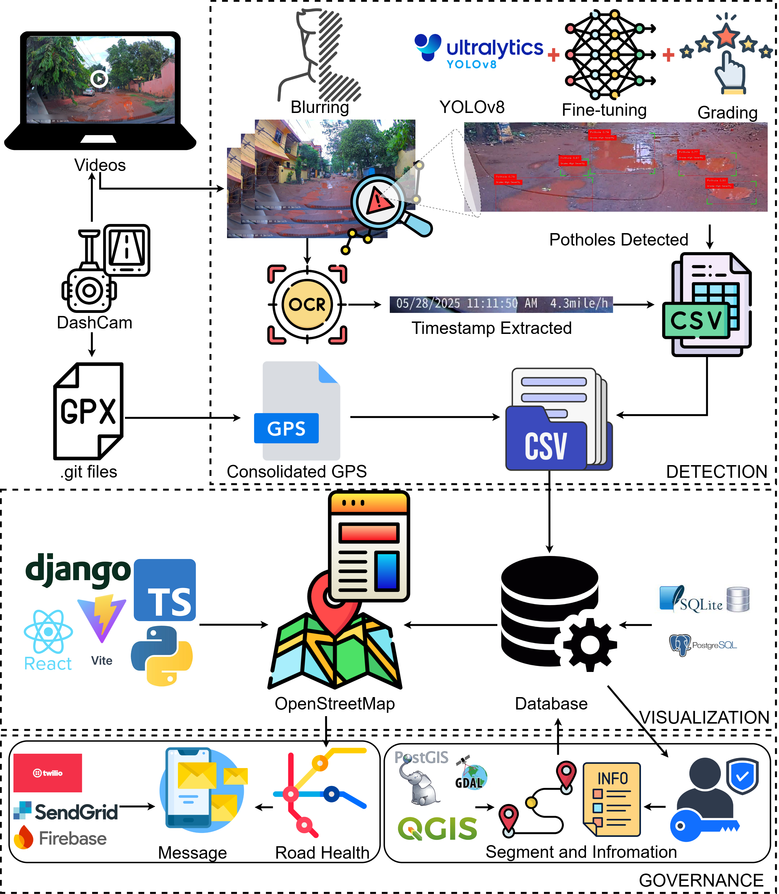

# iWatchRoadv2

[![CC BY-NC-SA 4.0][cc-by-nc-sa-shield]][cc-by-nc-sa]
[](https://www.typescriptlang.org)
[](https://github.com/smlab-niser/iWatchRoad)



## Overview

iWatchRoadv2 is an intelligent road infrastructure monitoring system that combines computer vision with web based mapping technology. The system automatically detects and tracks potholes using dashcam footage and provides a comprehensive web interface for monitoring and managing road conditions and attaching the contract information for the road health and governance.

> **Note**: This is the upgraded version of the original iWatchRoad system. For the previous version, please refer to the `iwatchroadv1` branch which contains the initial implementation and development history.

### Key Features

**🎥 Dashcam Processing System:**
- **YOLO-based Detection**: Real-time pothole detection using YOLOv8 object detection models
- **GPS Integration**: Precise location mapping using GPS data from dashcam footage
- **Computer Vision Pipeline**: Powered by OpenCV, CVZone, and Ultralytics for robust image processing
- **OCR Processing**: Automatic text extraction using EasyOCR for additional context
- **Machine Learning**: Advanced filtering and classification using scikit-learn and scipy
- **Automated Grading**: Intelligent severity assessment (Low/Moderate/High) based on pothole dimensions
- **Frame-by-Frame Analysis**: Comprehensive video processing with frame extraction and storage
- **Batch Processing**: Support for bulk video upload and processing

**🌐 Web Application:**
- **Interactive Mapping**: Built with React, TypeScript, and Leaflet for dynamic map visualization
- **Real-time Data**: Django REST Framework backend for seamless data management
- **Responsive Design**: Modern React based frontend with clustering and filtering capabilities
- **Data Analytics**: Comprehensive reporting and statistics for road authorities
- **Advanced Filtering**: Multi-parameter filtering by date range, severity, location, and status
- **Timeline Control**: Interactive timeline slider for temporal data exploration
- **Location Search**: Intelligent location-based search and navigation
- **Marker Clustering**: Smart clustering for optimal map performance with large datasets

**🏛️ Government Integration:**
- **Government Portal**: Dedicated interface for road authorities and contractors
- **Contractor Management**: Road segment allocation and contractor assignment system
- **Authentication System**: Secure login for government officials and authorized personnel
- **Road Health Visualization**: Color-coded overlay showing road condition status
- **Status Tracking**: Complete lifecycle management from detection to repair completion

**📊 Data Management & Analytics:**
- **Status Workflow**: Complete pothole lifecycle (Reported → Verified → In Progress → Fixed → Closed)
- **Severity Classification**: Automated grading system with visual indicators
- **Statistics Dashboard**: Real-time analytics with breakdown by severity, status, and location
- **Export Capabilities**: CSV data export for reporting and external analysis
- **Historical Data**: Comprehensive tracking of repairs and maintenance history
- **Performance Metrics**: Detailed statistics for monitoring infrastructure health

**🔧 Technical Features:**
- **RESTful API**: Complete API suite for third-party integrations
- **Image Storage**: Efficient frame image management with both file and base64 support
- **Error Handling**: Comprehensive error reporting and user feedback systems
- **Loading States**: Progressive loading with spinners and status indicators
- **Responsive UI**: Mobile-friendly interface with adaptive layout
- **Production Ready**: Gunicorn WSGI server configuration for deployment

## Technology Stack

### Backend (Django)
- **Framework**: Django 5.2+ with Django REST Framework
- **Database**: SQLite (configurable to PostgreSQL/MySQL)
- **Image Processing**: Pillow, OpenCV
- **API**: RESTful API with CORS support

### Frontend (React + TypeScript)
- **Framework**: React 19+ with TypeScript
- **Mapping**: Leaflet with React-Leaflet integration
- **Build Tool**: Vite for fast development and building
- **Clustering**: React-Leaflet-Cluster for marker management

### AI/ML Processing
- **Object Detection**: Ultralytics YOLOv8
- **Computer Vision**: OpenCV, CVZone
- **OCR**: EasyOCR for text recognition
- **Data Processing**: Pandas, NumPy for data manipulation
- **Machine Learning**: scikit-learn, scipy for advanced analytics

## Environment Setup

### Prerequisites
- Python 3.11+
- Node.js 18+
- Git

### 1. Clone the Repository
```bash
git clone https://github.com/smlab-niser/roadwatch.git
cd roadwatch
```

### 2. Backend Setup (Django)

#### Create Python Environment
```bash
# Using conda (recommended)
conda create -n roadwatch python=3.11 -y
conda activate roadwatch

# Or using venv
python -m venv roadwatch-env
# Windows
roadwatch-env\Scripts\activate
# Linux/Mac
source roadwatch-env/bin/activate
```

#### Install Backend Dependencies
```bash
cd code/backend
pip install -e .
```

#### Install Dashcam Processing Dependencies
```bash
cd dashcam_processor
pip install -r requirements.txt

# Install PyTorch with CUDA support (if you have a compatible GPU)
pip install torch torchvision torchaudio --index-url https://download.pytorch.org/whl/cu121
```

### 3. Frontend Setup (React)
```bash
cd code
npm install
```

## Configuration

### Database Configuration
**Important**: Before running the application, you must configure the secret key:

1. Navigate to `code/backend/pothole_tracker/settings.py`
2. Replace the `SECRET_KEY` value:
```python
# Change this line:
SECRET_KEY = '#######'

# To a secure secret key (generate one at https://djecrety.ir/):
SECRET_KEY = 'your-secure-secret-key-here'
```

### Database Setup
```bash
cd code/backend
python manage.py migrate
python manage.py createsuperuser  # Optional: create admin user
```

## Running the Application

### Development Mode

#### Start the Backend Server
```bash
cd code/backend
python manage.py runserver
```
The Django backend will be available at `http://localhost:8000`

#### Start the Frontend Development Server
```bash
cd code
npm run dev
```
The React frontend will be available at `http://localhost:5173`

### Production Deployment

#### Build Frontend for Production
```bash
cd code
npm run build
```

#### Collect Static Files (Django)
```bash
cd code/backend
python manage.py collectstatic
```

#### Start Production Server
```bash
cd code/backend
python start_production.py
```

## Usage

### Processing Dashcam Footage
1. Navigate to the upload section of the web interface
2. Upload your dashcam video files with GPS data
3. The system will automatically:
   - Process the video frame by frame
   - Detect potholes using YOLO models
   - Extract GPS coordinates
   - Store results in the database

### Viewing Results
1. Access the interactive map interface
2. Use filters to view specific time ranges or severity levels
3. Click on markers to view detailed information about detected potholes


### API Access
The system provides RESTful APIs for integration with other systems:
- `GET /api/potholes/` - List all detected potholes
- `POST /api/upload/` - Upload new dashcam footage
- `GET /api/statistics/` - Get summary statistics

## Project Structure
```
roadwatch/
├── README.md, LICENSE                  # Documentation & licensing
├── images/ (screenshots), .github/, .vscode/  # Assets & config
└── code/                               # Main application
    ├── Frontend (React + TypeScript)
    │   ├── package.json, vite.config.ts, tsconfig.json, eslint.config.js
    │   ├── index.html, public/, dist/  # Entry point & static assets
    │   └── src/
    │       ├── main.tsx, App.tsx, *.css  # Core app files
    │       ├── components/             # UI Components
    │       │   ├── Map: MapComponent, PotholeMarkers, Timeline, LocationSearch
    │       │   ├── UI: ControlPanel, FilterPanel, PotholeStats, Footer
    │       │   ├── Gov: GovLoginModal, GovMapComponent, RoadHealthOverlay
    │       │   └── Utils: UploadPage, LoadingSpinner, ErrorDisplay
    │       ├── services/ (API clients), types/ (TypeScript definitions)
    │       └── constants/ (config), utils/ (helpers)
    └── Backend (Django)
        ├── Core Files
        │   ├── manage.py, pyproject.toml, requirements*.txt, uv.lock
        │   ├── start_production.py, process_csv.py, restart_optimized.sh
        │   └── .env, db.sqlite3, pothole_gps_final.csv
        ├── Storage & Assets
        │   ├── media/ (uploads), static/, staticfiles/ (collected)
        │   ├── templates/ (Django HTML), logs/ (application logs)
        │   └── gunicorn/ (WSGI server config)
        ├── Django Apps
        │   ├── pothole_tracker/        # Main project
        │   │   └── settings.py, urls.py, wsgi.py, asgi.py, production_settings.py
        │   ├── potholes/               # Core pothole functionality
        │   │   └── models.py, views.py, serializers.py, admin.py, pagination.py
        │   ├── accounts/               # User management
        │   │   └── models.py, views.py, urls.py, admin.py
        │   └── government/             # Government portal
        │       └── models.py, views.py, urls.py
        └── AI/ML Processing (dashcam_processor/)
            ├── main.py (pipeline), yolo_detection.py, gps_parser.py
            ├── ocr_processor.py, pothole_grading.py, blurring.py
            └── setup.py, requirements.txt, README files
```

## Project Evolution

### Version History
- **iWatchRoadv2** (main branch) - Current enhanced version with improved UI, performance optimizations, and advanced features
- **iWatchRoad** (iwatchroadv1 branch) - Original implementation with core functionality

### Accessing Different Versions
To explore the original iWatchRoad system:
```bash
git checkout iwatchroadv1
```

To return to the latest version:
```bash
git checkout main
```
## Dataset

The **BharatPotHole** dataset accompanies iWatchRoad and is designed for pothole detection in Indian road environments. The dataset contains **7,000+ annotated frames** collected from forward-facing dashcam footage under diverse lighting, weather, and road conditions, providing realistic scenarios for training and evaluating pothole detection systems.
**Kaggle Link:** https://www.kaggle.com/datasets/surbhisaswatimohanty/bharatpothole 

If you use the dataset in your research, please cite the accompanying iWatchRoad paper.
## Citation 
If you use **iWatchRoad** in your research, please cite our paper:
```bibtex
@inproceedings{10.1145/3799830.3799873,
author = {Sahoo, Rishi Raj and Mohanty, Surbhi Saswati and Mishra, Subhankar},
title = {iWatchRoad: Scalable Detection and Geospatial Visualization of Potholes for Smart Cities},
year = {2026},
isbn = {9798400723551},
publisher = {Association for Computing Machinery},
address = {New York, NY, USA}, doi = {10.1145/3799830.3799873},
url = {https://doi.org/10.1145/3799830.3799873},
booktitle = {Proceedings of the 13th ACM IKDD International Conference on Data Science (CODS '25')},
pages = {262--270},
numpages = {9},
keywords = { Pothole detection, YOLO, GPS tagging, OpenStreetMap, Computer vision, Road maintenance, Real-time detection, Indian roads },
series = {CODS '25'} }
```

## Contributing
1. Fork the repository
2. Create a feature branch (`git checkout -b feature/amazing-feature`)
3. Commit your changes (`git commit -m 'Add amazing feature'`)
4. Push to the branch (`git push origin feature/amazing-feature`)
5. Open a Pull Request 

## License
This work is licensed under a
[Creative Commons Attribution-NonCommercial-ShareAlike 4.0 International License][cc-by-nc-sa].

[![CC BY-NC-SA 4.0][cc-by-nc-sa-image]][cc-by-nc-sa]

[cc-by-nc-sa]: http://creativecommons.org/licenses/by-nc-sa/4.0/
[cc-by-nc-sa-image]: https://licensebuttons.net/l/by-nc-sa/4.0/88x31.png
[cc-by-nc-sa-shield]: https://img.shields.io/badge/License-CC%20BY--NC--SA%204.0-lightgrey.svg

See the [LICENSE](LICENSE) file for details.
## Support
For questions and support, please open an issue on GitHub or contact the development team.
